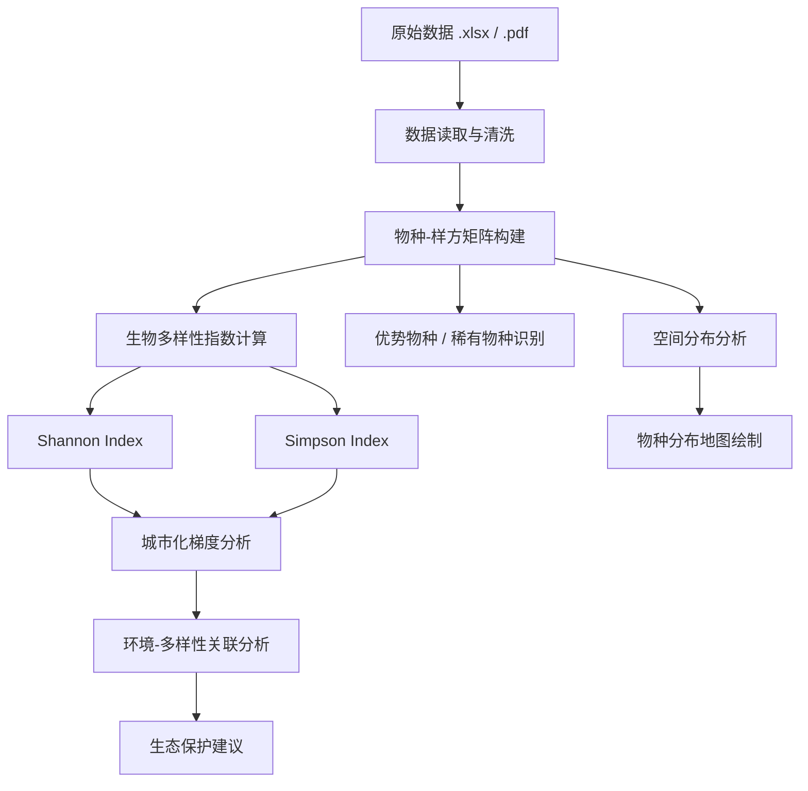

# 🦜 澳门生物多样性数据分析 — 校际团队挑战赛

> **2026 年澳门校际团队挑战赛 · 生物多样性数据科学项目**  
> 比赛时间：2026 年 5 月 18 日 — 7 月 3 日

---

## 👥 团队成员

| 姓名 | 角色 |
|------|------|
| **黄语萱** | 队长 |
| **莫欣睿** | 队员 |
| **林俊宇** | 队员 |

---

## 📋 项目简介

本项目参加 **2026 年澳门校际团队挑战赛**，围绕澳门生物多样性数据展开系统性的数据科学分析与可视化研究。项目分为两大部分：

### 第一部分：生物多样性基础分析

- 📊 计算 **香农指数（Shannon Index）** 与 **辛普森多样性指数（Simpson's Diversity Index）**
- 🔍 识别优势物种、稀有物种及生态指示物种
- 🗺️ 绘制生物多样性科普地图，展示具生态价值物种的空间分布

### 第二部分：进阶数据科学与分析

选题方向（四选一或综合）：

| 方向 | 研究内容 |
|------|---------|
| A | 物種之间的相互作用（食物网、共生、竞争、网络分析） |
| B | 气候变化对生物多样性的影响（SDM、气候情景预测） |
| C | 生态系统功能与服务（碳汇、水质净化、传粉评估） |
| D | 生物多样性与环境数据的关系（RDA/CCA、城市化梯度） |

> 📌 详见 [`第二部分选题建议与理由.md`](./报告文档/第二部分选题建议与理由.md)，内含国际竞赛获奖趋势分析与三套推荐选题方案。

### 最终产出

- 📜 **学术海报**（A0 尺寸，300 dpi 物种空间分布图）
- 🎬 **科普短片**（≤ 5 分钟）

---

## 📁 项目结构

```
Biodiversity_competition/
├── README.md                          # 项目说明（本文件）
├── convert_to_csv.py                  # xlsx → CSV 批量转换工具
├── read_data.py                       # 主数据读取脚本
├── requirements.txt                   # Python 依赖清单
├── a.txt                              # 比赛内容摘要
├── .gitignore
│
├── 报告文档/                           # 📝 分析类 Markdown 文档
│   ├── Python环境配置说明.md           # Python 环境配置记录
│   ├── 数据综合分析报告.md             # 数据包综合分析报告
│   ├── 校际团队挑战赛要求.md           # 比赛官方要求
│   └── 第二部分选题建议与理由.md        # 选题策略分析
│
├── 数据包/                            # 📦 原始数据目录
│   ├── 2025 團隊賽數據包.xlsx          # 2025 年生物多样性数据
│   ├── 副本2026 團隊賽數據包.xlsx       # 2026 年数据副本
│   ├── 2025 團隊賽數據包說明.pdf        # 2025 年数据说明文档
│   ├── 2026 團隊賽數據包說明.pdf        # 2026 年数据说明文档
│   ├── 校際團隊挑戰賽.jpg              # 比赛宣传图
│   └── read_data.py                   # 数据包内读取脚本
│
├── 表格数据/                           # 📊 转换后的 CSV 数据
│   ├── 2025 團隊賽數據包_Sheet1.csv    # 2025 年完整数据
│   ├── 副本2026 團隊賽數據包_Sheet1.csv # 2026 年完整数据
│   ├── _元数据摘要.json                # 数据结构元信息
│   └── 数据预览/                       # 各数据集前 100 行预览
│       ├── 2025 團隊賽數據包_Sheet1_预览.csv
│       └── 副本2026 團隊賽數據包_Sheet1_预览.csv
│
└── venv/                              # Python 虚拟环境（已加入 .gitignore）
```

---

## 🚀 快速开始

### 环境要求

- **Python** ≥ 3.10（项目使用 3.14.3）
- **依赖包**：`openpyxl`、`pdfplumber`

### 安装与运行

```bash
# 1. 克隆仓库
git clone <repo-url>
cd Biodiversity_competition

# 2. 创建虚拟环境
python -m venv venv

# 3. 激活虚拟环境（Windows PowerShell）
.\venv\Scripts\Activate.ps1

# 4. 安装依赖
pip install -r requirements.txt

# 5. 运行数据读取脚本
python read_data.py
```

> 💡 详细的环境配置说明见 [`Python环境配置说明.md`](./报告文档/Python环境配置说明.md)

---

## 🛠️ 技术栈

| 类别 | 工具/库 |
|------|--------|
| 编程语言 | Python 3.14 |
| 数据处理 | `openpyxl`（Excel 读取）、`pdfplumber`（PDF 解析） |
| 数据分析 | `pandas`、`numpy`（规划中） |
| 可视化 | `matplotlib`、`seaborn`、`folium`/`geopandas`（规划中） |
| 生物多样性指数 | Shannon Index、Simpson's Diversity Index |
| 高级分析 | RDA/CCA 分析、物种共现网络、SDM（规划中） |
| AI 工具 | 辅助数据分析与可视化呈现 |

---

## 📊 数据分析流程



---

## ⚠️ AI 工具使用声明

本项目在数据分析与可视化呈现环节中使用了 **AI 辅助工具**（包括 GitHub Copilot）。根据比赛要求，最终提交的学术海报及科普短片上均将标注「使用 AI 工具」。

---

## 📝 许可

本项目为学术竞赛作品，仅供学习与交流使用。

---

## 📮 联系方式

如有问题或建议，欢迎通过 GitHub Issues 联系我们。

---

<p align="center">
  <b>🐾 守护澳门生物多样性，从数据科学开始 🌿</b>
</p>
